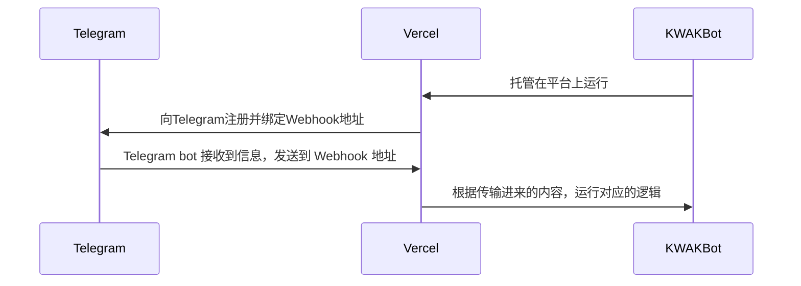

# KWAKBot

KWAK = Keyword Auto Kick，是自动检测加入群组的用户的名字里是否存在违禁词并进行操作的bot，如果用户的名字存在违禁词，则会被踢出群组（前提是bot得设置为管理员）

本项目部署在Vercel上，实现了通过Serverless搭建Telegram Bot的目的，同时Vercel的Hobby计划足以支撑这一bot的运行无需再购买服务器。（同时也不必担心代理问题）

> [!important]
>
> Demo: [@KW4KBot](https://t.me/KW4KBot)



## 快速上手

本Bot具有以下环境变量

|       变量名       | 必填 |                           变量作用                           |                        变量内容要求                        |                     内容示例                     |
| :----------------: | ---- | :----------------------------------------------------------: | :--------------------------------------------------------: | :----------------------------------------------: |
|      KEYWORDS      | √    |      关键词，当用户的名字里含有这些关键词的时候会被踢出      |   每个关键词之间用`, `进行分隔（一个半角逗号，一个空格）   |               `hello, world, junk`               |
|       OWNER        | √    |      管理者的Telegram用户ID（通过@userinfobot可以获取）      | 每个管理员的ID之间用`, `进行分隔（一个半角逗号，一个空格） |              `12345678, 1145141919`              |
|  WEBHOOK_BASE_URL  | √    |  Telegram用于hook本程序的URL，一般填入vercel提供的域名即可   |             无，但是一定要注意`https://`协议头             |            `https://kwak.vercel.app`             |
| VERCEL_PROJECT_ID  | √    |    部署项目的ID，因为添加或删除关键词要对项目进行重新部署    |                             无                             |        `prj_ZkZtusrbkdCMW9gXXXXXXXXXXXXx`        |
|    VERCEL_TOKEN    | √    |                 个人Token，用于进行API的请求                 |                             无                             |            `wflR5sXXXXXXXXXX8mYfsreu`            |
|   VERCEL_TEAM_ID   | ×    | **当你把本项目作为团队项目的时候才需要！！！放在个人账号下千万不要填！！！** |                             无                             |            `team_kdCMW9gBfwdDW8mYfqa`            |
| TELEGRAM_BOT_TOKEN | √    |             Telegram bot的token，跟Botfather去拿             |                             无                             | `6881445245:AAEHYU-ydYnuvC267r1-PhcGVCo_OK0b45E` |

### 变量获取

#### KEYWORDS

只需要填入你自己想要的关键词就行了

#### OWNER

访问[@userinfobot](https://t.me/userinfobot)，输入`/start`，返回的消息中`Id`后面的数字就是


#### WEBHOOK_BASE_URL

部署完成后，vercel给你提供的域名就是了

在项目下，点击`Settings`，左边点击`Domains`就能看到了


#### VERCEL_PROJECT_ID

在Vercel项目的设置，点击左边的`General`，往下滑有Project ID


#### VERCEL_TOKEN

点击右上角自己的头像，然后点`Account Settings`，接着左边点击`Tokens`自己创建一个就行

#### VERCEL_TEAM_ID

~~用团队账户的应该不用我教~~

#### TELEGRAM_BOT_TOKEN

找[@Botfather](https://t.me/BotFather)去创建一个bot就会给你了

### 部署项目

fork一份本仓库到自己的账户下，然后去Vercel选择`New`，然后再点`Project`，从自己的Github导入即可

第一次部署可以不填任何的信息（毕竟`VERCEL_PROJECT_ID`和`WEBHOOK_BASE_URL`都没有），然后自己再去填

填完了以后重新部署，部署完成后一定要先访问一次`https://<your-project>.vercel.app/setWebhook`跟Telegram进行Webhook的注册，然后才可以使用，注册成功会弹下面这样的提示

```json
{
    "status": "success",
    "message": "Webhook 设置成功！"
}
```

### 设置关键词

你可以在一开始就在`KEYWORD`变量中添加关键词，也可以去找bot添加，用`/kwadd <kw1> <kw2> ...`这样的方式添加，删除使用`/kwdel`，还可以一键清理，使用`/kwclear`即可

### 命令列表

```
/help - 显示帮助信息
/about - 显示机器人信息
/keywords - 显示关键词
/kwadd <关键词> - 添加关键词（管理员）
/kwdel <关键词> - 删除关键词（管理员）
/kwclear - 清空关键词（管理员）
```

